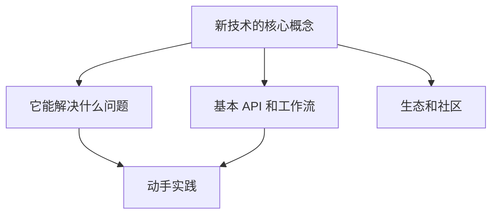

## 学习是一种元技能

技术领域变化太快——今天的热门框架明天可能就被替代。与其追逐每一个新技术，不如建立一套**高效学习的系统**。

## 我的学习框架

### 1. 明确学习动机

在开始之前问自己三个问题：

- **Why** — 为什么学这个？（解决什么实际问题？）
- **What** — 学到什么程度？（会用就行还是深入原理？）
- **How** — 用什么方式学？（文档、视频、实践项目？）

> 没有清晰目标的学习就像没有目的地的航行。

### 2. 建立最小知识地图

不要试图一开始就理解所有细节。先构建一个"知识地图"：

### 3. 20 小时入门法则

Josh Kaufman 的研究表明，学习任何新技能只需要 **20 小时的专注练习**就能达到"够用"的水平：

- **前 5 小时**：阅读官方文档和入门教程
- **5-10 小时**：跟着教程做项目
- **10-15 小时**：独立做一个自己的项目
- **15-20 小时**：阅读源码，理解原理

### 4. 费曼学习法

> 如果你不能简单地解释它，说明你还没有真正理解它。

试着把学到的概念讲给一个"小白"听，或者写一篇博客文章。这个过程会暴露你理解中的漏洞。

### 5. 建立知识连接

新知识只有和旧知识产生连接，才能真正内化：

| 新技术 | 类比 | 旧知识 |
|--------|------|--------|
| React Hooks | ≈ | Vue Composition API |
| Docker | ≈ | 虚拟机（但更轻量） |
| GraphQL | ≈ | SQL（但是前端驱动的） |

## 实践建议

1. **做，不要只看** — 敲代码是最好的学习方式
2. **教别人** — 写博客、做分享
3. **定期回顾** — 用 Anki 或间隔重复
4. **保持好奇** — 最好的学习者永远保持好奇心

## 结语

技术在变，但学习方法不变。投资于你的学习能力，这是回报率最高的投资。
